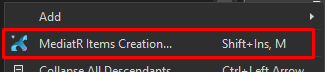
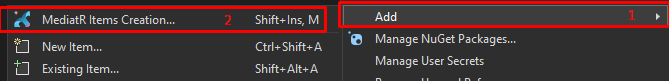
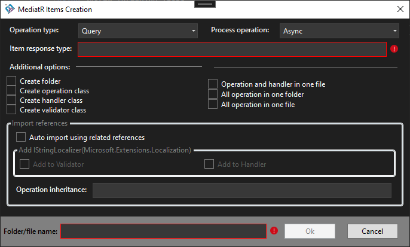

You can install extensions from <a href="https://marketplace.visualstudio.com/publishers/RzR" target="_blank">link (click there)</a>.

**To use extensions you must have already installed the following packages: `FluentValidation` and `MediatR`.**

After installing the VS extension `MediatRItemExtension.V2K19` or `MediatRItemExtension.V2K22` (depending on which Visual Studio version you have installed).

Trigger/activate extension can be thought of as a `shortcut` or from the project/folder `context menu`: <br />

Select a project or a folder form the solution:<br />
 -> `SHIFT + INSERT + M`; <br />
 -> Right click and select `MediatR Items Creation`.
 
 <div align="center" width="100%">
  <br />
     <span><strong>Fig. 1</strong> - Right click on the folder</span>
 </div> <br/>

 Or from default item `Add` and then `MediatR Items Creation`:
 
 <div align="center" width="100%">
  <br />
     <span><strong>Fig. 2</strong> - Right click on the solution/project</span>
 </div> <br/>
 
 As result you will see the main window of interaction.
 
  <div align="center" width="100%">
  <br />
     <span><strong>Fig. 3</strong> - Main window</span>
 </div> <br/>
 
 In the main windows are represented a few settings which are saved to the current selected project.

<hr />

The first option is `operation type`:<br />
-> `Query` - Create a query concept (get/extract information);<br />
-> `Command` - Create a command concept (add/edit/delete information);<br />
-> `Notification` - Create a notification concept.<br />

The second option is `process operation` type:<br />
-> `Sync`;<br />
-> `Async`. <br />

The third option (*required field*) is operation response type input.

The fourth block with options/checkboxes which allows to create of specific files, folders, and import-related references.

The fifth option (*required field*) is the name of the folder where information will be stored (also used for the class's name).

<hr />

When the user selects the `Add to Validator` checkbox, the new file will be imported the reference and added to the constructor injection of `IStringLocalizer`.
```csharp
using Microsoft.Extensions.Localization;
using FluentValidation;

namespace ProjectNamespace.GetArticle
{
    public class GetArticleValidator : AbstractValidator<GetArticleQuery>
    {
        public GetArticleValidator(IStringLocalizer stringLocalizer)
        {
        }
    }
}
```
When the user selects the `Add to Handler` checkbox, the new file will be imported the reference and added to the constructor injection of `IStringLocalizer`.
```csharp
using Microsoft.Extensions.Localization;
using System.Threading;
using MediatR;
using System;
using System.Threading.Tasks;

namespace ProjectNamespace.GetArticle
{
    public class GetArticleHandler : IRequestHandler<GetArticleQuery, int>
    {
        public GetArticleHandler(IStringLocalizer stringLocalizer)
        {
        }

        public async Task<int> Handle(GetArticleQuery request, CancellationToken cancellationToken)
        {
            throw new NotImplementedException();
        }
    }
}
```
When the user specify anything in the `Operation inheritance` input, the new file before the `INotification/IRequest` will be added base classs (specified field value).

```csharp
public class GetArticleQuery : BaseClass, IRequest<int>
{
}
```
